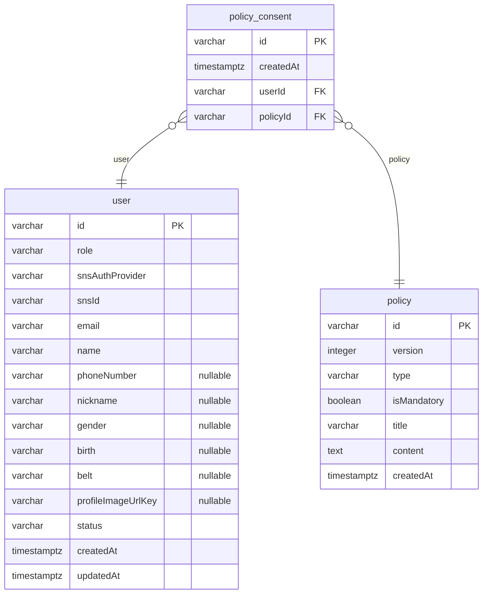
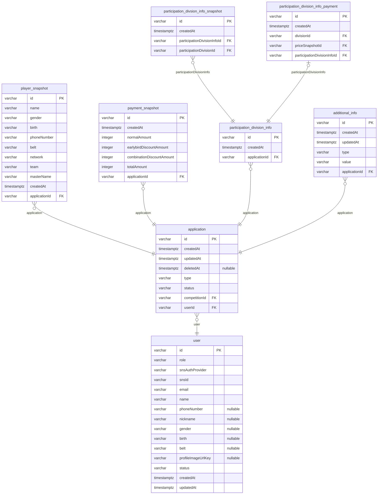
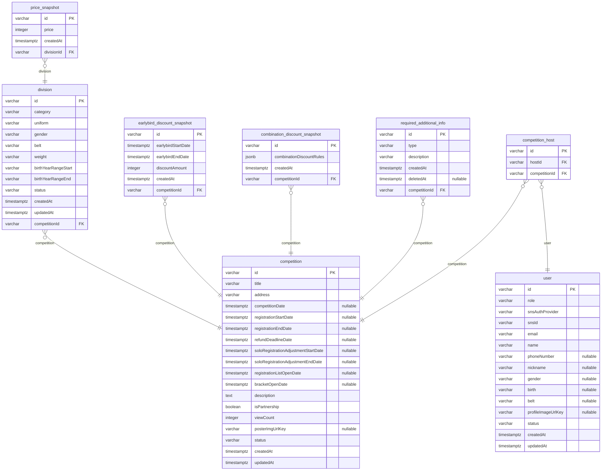

# NAJUHA V2 ERD

> Generated by [`typeorm-markdown-generator`](https://github.com/hermin9804/typeorm-markdown-generator)

## Table of Contents

- [User](#user)
- [Application](#application)
- [Competition](#competition)

## User

### `policy`

Policy Entity   
@namespace User

**Properties**

  - `id`
  - `version`
  - `type`
  - `isMandatory`
  - `title`
  - `content`
  - `createdAt`

### `policy_consent`

PolicyConsent Entity   
@namespace User

**Properties**

  - `id`
  - `createdAt`
  - `userId`
  - `policyId`: - policyId.

### `user`

User Entity   
@namespace User   
@erd Competition   
@erd Application

**Properties**

  - `id`
  - `role`
  - `snsAuthProvider`
  - `snsId`
  - `email`
  - `name`
  - `phoneNumber`
  - `nickname`
  - `gender`
  - `birth`
  - `belt`
  - `profileImageUrlKey`
  - `status`
  - `createdAt`
  - `updatedAt`

## Application

### `player_snapshot`

PlayerSnapshot Entity   
@namespace Application

**Properties**

  - `id`
  - `name`
  - `gender`
  - `birth`
  - `phoneNumber`
  - `belt`
  - `network`
  - `team`
  - `masterName`
  - `createdAt`
  - `applicationId`

### `payment_snapshot`

PaymentSnapshot Entity   
@namespace Application

**Properties**

  - `id`
  - `createdAt`
  - `normalAmount`
  - `earlybirdDiscountAmount`
  - `combinationDiscountAmount`
  - `totalAmount`
  - `applicationId`

### `participation_divsion_info_snapshot`

ParticipationDivisionInfoSnapshot Entity   
@namespace Application

**Properties**

  - `id`
  - `createdAt`
  - `participationDivisionInfoId`
  - `participationDivisionId`

### `participation_division_info`

ParticipationDivisionInfo Entity   
@namespace Application

**Properties**

  - `id`
  - `createdAt`
  - `applicationId`

### `participation_division_info_payment`

ParticipationDivisionInfoPayment Entity   
@namespace Application

**Properties**

  - `id`
  - `createdAt`
  - `divisionId`
  - `priceSnapshotId`
  - `participationDivisionInfoId`

### `additional_info`

AdditionalInfo Entity   
@namespace Application

**Properties**

  - `id`
  - `createdAt`
  - `updatedAt`
  - `type`
  - `value`
  - `applicationId`

### `application`

Application Entity   
@namespace Application

**Properties**

  - `id`
  - `createdAt`
  - `updatedAt`
  - `deletedAt`
  - `type`
  - `status`
  - `competitionId`
  - `userId`

## Competition

### `price_snapshot`

PriceSnapshot Entity   
@namespace Competition

**Properties**

  - `id`
  - `price`
  - `createdAt`
  - `divisionId`

### `division`

Division Entity   
@namespace Competition

**Properties**

  - `id`
  - `category`
  - `uniform`
  - `gender`
  - `belt`
  - `weight`
  - `birthYearRangeStart`
  - `birthYearRangeEnd`
  - `status`
  - `createdAt`
  - `updatedAt`
  - `competitionId`

### `earlybird_discount_snapshot`

EarlybirdDiscountSnapshot Entity   
@namespace Competition

**Properties**

  - `id`
  - `earlybirdStartDate`
  - `earlybirdEndDate`
  - `discountAmount`
  - `createdAt`
  - `competitionId`

### `combination_discount_snapshot`

CombinationDiscountSnapshot Entity   
@namespace Competition

**Properties**

  - `id`
  - `combinationDiscountRules`
  - `createdAt`
  - `competitionId`

### `required_additional_info`

RequiredAdditionalInfo Entity   
@namespace Competition

**Properties**

  - `id`
  - `type`
  - `description`
  - `createdAt`
  - `deletedAt`
  - `competitionId`

### `competition_host`

Competition Host Map Entity   
@namespace Competition

**Properties**

  - `id`
  - `hostId`
  - `competitionId`

### `competition`

Competition Entity   
@namespace Competition

**Properties**

  - `id`
  - `title`
  - `address`
  - `competitionDate`
  - `registrationStartDate`
  - `registrationEndDate`
  - `refundDeadlineDate`
  - `soloRegistrationAdjustmentStartDate`
  - `soloRegistrationAdjustmentEndDate`
  - `registrationListOpenDate`
  - `bracketOpenDate`
  - `description`
  - `isPartnership`
  - `viewCount`
  - `posterImgUrlKey`
  - `status`
  - `createdAt`
  - `updatedAt`

