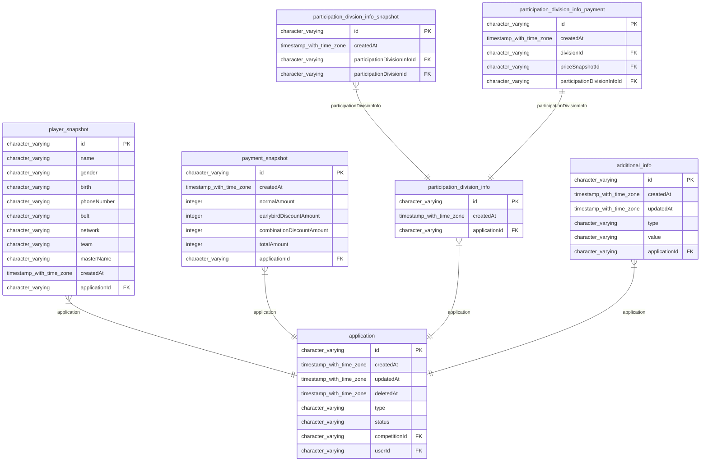
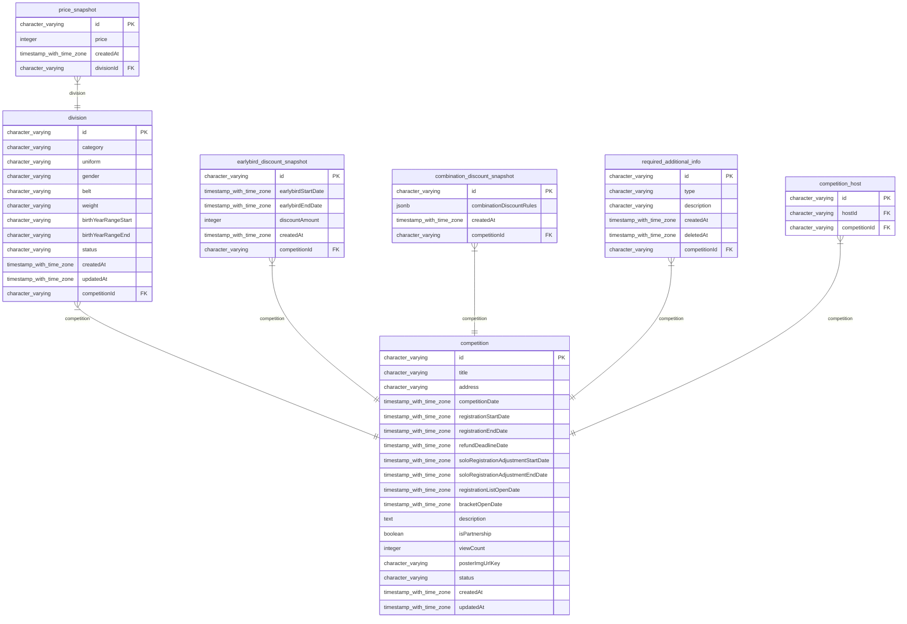
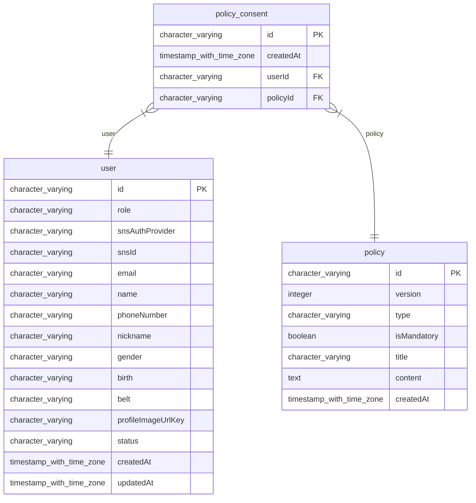

# NAJUHA V2 ERD

> Generated by [`typeorm-markdown`](https://github.com/hermin9804/typeorm-markdown)

## Table of Contents

- [Application](#application)
- [Competition](#competition)
- [User](#user)

## Application

### additional_info

AdditionalInfo Entity
@namespace Application

**Properties**

  - `id`: 
  - `createdAt`: 
  - `updatedAt`: 
  - `type`: 
  - `value`: 
  - `applicationId`: 
  - `application`: 

### application

Application Entity
@namespace Application

**Properties**

  - `id`: 
  - `createdAt`: 
  - `updatedAt`: 
  - `deletedAt`: 
  - `type`: 
  - `status`: 
  - `playerSnapshots`: 
  - `paymentSnapshots`: 
  - `participationDivisionInfos`: 
  - `competitionId`: 
  - `competition`: 
  - `userId`: 
  - `user`: 
  - `additionalInfos`: 

### participation_division_info_payment

ParticipationDivisionInfoPayment Entity
@namespace Application

**Properties**

  - `id`: 
  - `createdAt`: 
  - `divisionId`: 
  - `division`: 
  - `priceSnapshotId`: 
  - `priceSnapshot`: 
  - `participationDivisionInfoId`: 
  - `participationDivisionInfo`: 

### participation_divsion_info_snapshot

ParticipationDivisionInfoSnapshot Entity
@namespace Application

**Properties**

  - `id`: 
  - `createdAt`: 
  - `participationDivisionInfoId`: 
  - `participationDivisionInfo`: 
  - `participationDivisionId`: 
  - `division`: 

### participation_division_info

ParticipationDivisionInfo Entity
@namespace Application

**Properties**

  - `id`: 
  - `createdAt`: 
  - `applicationId`: 
  - `application`: 
  - `participationDivisionInfoSnapshots`: 
  - `participationDivisionInfoPayment`: 

### payment_snapshot

PaymentSnapshot Entity
@namespace Application

**Properties**

  - `id`: 
  - `createdAt`: 
  - `normalAmount`: 
  - `earlybirdDiscountAmount`: 
  - `combinationDiscountAmount`: 
  - `totalAmount`: 
  - `applicationId`: 
  - `application`: 

### player_snapshot

PlayerSnapshot Entity
@namespace Application

**Properties**

  - `id`: 
  - `name`: 
  - `gender`: 
  - `birth`: 
  - `phoneNumber`: 
  - `belt`: 
  - `network`: 
  - `team`: 
  - `masterName`: 
  - `createdAt`: 
  - `applicationId`: 
  - `application`: 

## Competition

### combination_discount_snapshot

CombinationDiscountSnapshot Entity
@namespace Competition

**Properties**

  - `id`: 
  - `combinationDiscountRules`: 
  - `createdAt`: 
  - `competitionId`: 
  - `competition`: 

### competition_host

Competition Host Map Entity
@namespace Competition

**Properties**

  - `id`: 
  - `hostId`: 
  - `competitionId`: 
  - `user`: 
  - `competition`: 

### competition

Competition Entity
@namespace Competition

**Properties**

  - `id`: 
  - `title`: 
  - `address`: 
  - `competitionDate`: 
  - `registrationStartDate`: 
  - `registrationEndDate`: 
  - `refundDeadlineDate`: 
  - `soloRegistrationAdjustmentStartDate`: 
  - `soloRegistrationAdjustmentEndDate`: 
  - `registrationListOpenDate`: 
  - `bracketOpenDate`: 
  - `description`: 
  - `isPartnership`: 
  - `viewCount`: 
  - `posterImgUrlKey`: 
  - `status`: 
  - `createdAt`: 
  - `updatedAt`: 
  - `divisions`: 
  - `earlybirdDiscountSnapshots`: 
  - `combinationDiscountSnapshots`: 
  - `requiredAdditionalInfos`: 
  - `applications`: 
  - `competitionHostMaps`: 

### division

Division Entity
@namespace Competition

**Properties**

  - `id`: 
  - `category`: 
  - `uniform`: 
  - `gender`: 
  - `belt`: 
  - `weight`: 
  - `birthYearRangeStart`: 
  - `birthYearRangeEnd`: 
  - `status`: 
  - `createdAt`: 
  - `updatedAt`: 
  - `competitionId`: 
  - `competition`: 
  - `priceSnapshots`: 
  - `participationDivisionInfoSnapshots`: 

### earlybird_discount_snapshot

EarlybirdDiscountSnapshot Entity
@namespace Competition

**Properties**

  - `id`: 
  - `earlybirdStartDate`: 
  - `earlybirdEndDate`: 
  - `discountAmount`: 
  - `createdAt`: 
  - `competitionId`: 
  - `competition`: 

### price_snapshot

PriceSnapshot Entity
@namespace Competition

**Properties**

  - `id`: 
  - `price`: 
  - `createdAt`: 
  - `divisionId`: 
  - `division`: 
  - `participationDivisionInfoPayments`: 

### required_additional_info

RequiredAdditionalInfo Entity
@namespace Competition

**Properties**

  - `id`: 
  - `type`: 
  - `description`: 
  - `createdAt`: 
  - `deletedAt`: 
  - `competitionId`: 
  - `competition`: 

## User

### policy

Policy Entity
@namespace User

**Properties**

  - `id`: 
  - `version`: 
  - `type`: 
  - `isMandatory`: 
  - `title`: 
  - `content`: 
  - `createdAt`: 
  - `policyConsents`: 

### policy_consent

PolicyConsent Entity
@namespace User

**Properties**

  - `id`: 
  - `createdAt`: 
  - `userId`: 
  - `user`: - user
  - `policyId`: - policyId.
  - `policy`: - policy

### user

User Entity
@namespace User

**Properties**

  - `id`: 
  - `role`: 
  - `snsAuthProvider`: 
  - `snsId`: 
  - `email`: 
  - `name`: 
  - `phoneNumber`: 
  - `nickname`: 
  - `gender`: 
  - `birth`: 
  - `belt`: 
  - `profileImageUrlKey`: 
  - `status`: 
  - `createdAt`: 
  - `updatedAt`: 
  - `policyConsents`: 
  - `applications`: 
  - `competitionHostMaps`: 

