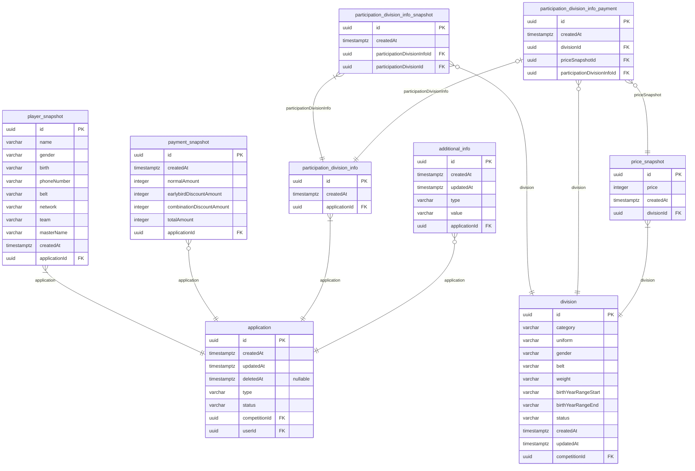
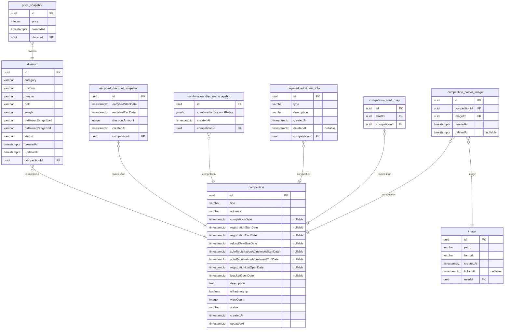

# NAJUHA V2 ERD

> Generated by [`typeorm-markdown-generator`](https://github.com/hermin9804/typeorm-markdown-generator)

## Table of Contents

- [User](#user)
- [Application](#application)
- [Competition](#competition)
- [Post](#post)
- [Image](#image)

## User

### `policy`

Policy Entity   
@namespace User

**Properties**

  - `id`
  - `version`
  - `type`
  - `isMandatory`
  - `title`
  - `content`
  - `createdAt`

### `policy_consent`

PolicyConsent Entity   
@namespace User

**Properties**

  - `id`
  - `createdAt`
  - `userId`
  - `policyId`: - policyId.

### `user_profile_image`

UserProfileImage Entity   
@namespace User   
@erd Image

**Properties**

  - `id`
  - `userId`
  - `imageId`
  - `createdAt`
  - `deletedAt`

### `user`

User Entity   
@namespace User

**Properties**

  - `id`
  - `role`
  - `snsAuthProvider`
  - `snsId`
  - `email`
  - `name`
  - `phoneNumber`
  - `nickname`
  - `gender`
  - `birth`
  - `belt`
  - `status`
  - `createdAt`
  - `updatedAt`

## Application

### Indexes

| Table | Index Name | Columns | Unique | Spatial | Where |
|-------|-------------|---------|--------|---------|-----------|
| player_snapshot | IDX_PlayerSnapshot_applicationId | applicationId | false | false |  |
| participation_division_info_snapshot | IDX_ParticipationDivisionInfoSnapshot_participationDivisionInfoId | participationDivisionInfoId | false | false |  |
| participation_division_info | IDX_ParticipationDivisionInfo_applicationId | applicationId | false | false |  |
| price_snapshot | IDX_PriceSnapshot_divisionId | divisionId | false | false |  |
| division | IDX_Division_competitionId | competitionId | false | false |  |
| additional_info | IDX_AddtionalInfo_applicationId | applicationId | false | false |  |
| application | IDX_Application_userId_createdAt | userId, createdAt | false | false |  |

### `player_snapshot`

PlayerSnapshot Entity   
@namespace Application

**Properties**

  - `id`
  - `name`
  - `gender`
  - `birth`
  - `phoneNumber`
  - `belt`
  - `network`
  - `team`
  - `masterName`
  - `createdAt`
  - `applicationId`

### `payment_snapshot`

PaymentSnapshot Entity   
@namespace Application

**Properties**

  - `id`
  - `createdAt`
  - `normalAmount`
  - `earlybirdDiscountAmount`
  - `combinationDiscountAmount`
  - `totalAmount`
  - `applicationId`

### `participation_division_info_snapshot`

ParticipationDivisionInfoSnapshot Entity   
@namespace Application

**Properties**

  - `id`
  - `createdAt`
  - `participationDivisionInfoId`
  - `participationDivisionId`

### `participation_division_info`

ParticipationDivisionInfo Entity   
@namespace Application

**Properties**

  - `id`
  - `createdAt`
  - `applicationId`

### `participation_division_info_payment`

ParticipationDivisionInfoPayment Entity   
@namespace Application

**Properties**

  - `id`
  - `createdAt`
  - `divisionId`
  - `priceSnapshotId`
  - `participationDivisionInfoId`

### `additional_info`

AdditionalInfo Entity   
@namespace Application

**Properties**

  - `id`
  - `createdAt`
  - `updatedAt`
  - `type`
  - `value`
  - `applicationId`

### `application`

Application Entity   
@namespace Application

**Properties**

  - `id`
  - `createdAt`
  - `updatedAt`
  - `deletedAt`
  - `type`
  - `status`
  - `competitionId`
  - `userId`

## Competition

### Indexes

| Table | Index Name | Columns | Unique | Spatial | Where |
|-------|-------------|---------|--------|---------|-----------|
| price_snapshot | IDX_PriceSnapshot_divisionId | divisionId | false | false |  |
| division | IDX_Division_competitionId | competitionId | false | false |  |
| earlybird_discount_snapshot | IDX_EarlybirdDiscountSnapshot_competitionId | competitionId | false | false |  |
| combination_discount_snapshot | IDX_CombinationDiscountSnapshot_competitionId | competitionId | false | false |  |
| required_additional_info | IDX_RequiredAdditionalInfo_competitionId | competitionId | false | false |  |
| competition_host_map | IDX_CompetitionHostMap_competitionId | competitionId | false | false |  |
| competition | IDX_Competition_status | status | false | false |  |
| competition | IDX_Competition_competitionDate | competitionDate | false | false |  |

### `price_snapshot`

PriceSnapshot Entity   
@namespace Competition   
@erd Application

**Properties**

  - `id`
  - `price`
  - `createdAt`
  - `divisionId`

### `division`

Division Entity   
@namespace Competition   
@erd Application

**Properties**

  - `id`
  - `category`
  - `uniform`
  - `gender`
  - `belt`
  - `weight`
  - `birthYearRangeStart`
  - `birthYearRangeEnd`
  - `status`
  - `createdAt`
  - `updatedAt`
  - `competitionId`

### `earlybird_discount_snapshot`

EarlybirdDiscountSnapshot Entity   
@namespace Competition

**Properties**

  - `id`
  - `earlybirdStartDate`
  - `earlybirdEndDate`
  - `discountAmount`
  - `createdAt`
  - `competitionId`

### `combination_discount_snapshot`

CombinationDiscountSnapshot Entity   
@namespace Competition

**Properties**

  - `id`
  - `combinationDiscountRules`
  - `createdAt`
  - `competitionId`

### `required_additional_info`

RequiredAdditionalInfo Entity   
@namespace Competition

**Properties**

  - `id`
  - `type`
  - `description`
  - `createdAt`
  - `deletedAt`
  - `competitionId`

### `competition_host_map`

Competition Host Map Entity   
@namespace Competition

**Properties**

  - `id`
  - `hostId`
  - `competitionId`

### `competition_poster_image`

CompetitionPosterImage Entity   
@namespace Competition   
@erd Image

**Properties**

  - `id`
  - `competitionId`
  - `imageId`
  - `createdAt`
  - `deletedAt`

### `competition`

Competition Entity   
@namespace Competition

**Properties**

  - `id`
  - `title`
  - `address`
  - `competitionDate`
  - `registrationStartDate`
  - `registrationEndDate`
  - `refundDeadlineDate`
  - `soloRegistrationAdjustmentStartDate`
  - `soloRegistrationAdjustmentEndDate`
  - `registrationListOpenDate`
  - `bracketOpenDate`
  - `description`
  - `isPartnership`
  - `viewCount`
  - `status`
  - `createdAt`
  - `updatedAt`

## Post

### `comment_report`

CommentReport.   
   
댓글의 신고정보를 담는 Entity입니다.   
신고 횟수가 10회 이상이면 해당 댓글이 `INACTIVE` 상태로 변경되고, 유저에게 노출되지 않습니다.   
동일한 유저가 동일한 댓글을 여러 번 신고할 수 없습니다. (중복신고 불가능)   
   
@namespace Post

**Properties**

  - `id`: UUID v7.
  - `type`
    > 신고 타입.
    > - `INAPPROPRIATE`: 부적절한 내용.
    > - `SPAM`: 스팸.
  - `status`
    > 신고 상태.
    > `ACCEPTED`상태의 신고가 10회 이상이면 해당 댓글이 `INACTIVE` 상태로 변경됩니다.
    > - `ACCEPTED`: 신고 승인.
    > - `REJECTED`: 신고 거부.
  - `reason`: 신고 사유.
  - `userId`: 신고자 UserId.
  - `createdAt`: 신고일자.
  - `commentId`: 신고된 댓글의 Id.

### `comment_snapshot`

CommentSnapshot.   
   
댓글의 스냅샷 정보를 담는 Entity입니다.   
`comment`에서 언급한 것처럼 증거를 보관하고 사기를 방지하기 위해 댓글 레코드에서 댓글 내용을 분리하여 보관합니다.   
   
@namespace Post

**Properties**

  - `id`: UUID v7.
  - `body`: 댓글 내용.
  - `createdAt`: 댓글 작성일자.
  - `commentId`: 댓글 Id.

### `comment`

Comment, CommentRpely.   
댓글 or 대댓글을 식별하는 최상위 엔티티로서 개별 댓글의 메타데이터를 담고 있습니다.   
   
댓글의 내용(body) `comment`에 존재하지 않고, `comment_snapshot`에 저장되어 있습니다.   
`comment`와 `comment_snapshot`는 1:N 관계로 연결되어 있는데, 이는 댓글이 수정될때마다 새로운 스냅샷 레코드가 생성되기 때문입니다.   
   
댓글이 수정될때마다 새로운 스냅샷 레코드가 생성되는 이유는 증거를 보존 및 추적하기 위함입니다. 온라인 커뮤니티의 특성상 참여자 간에는 항상 분쟁의 위험이 존재합니다.   
그리고 분쟁은 글이나 댓글을 통해 발생할 수 있으며, 기존 댓글을 수정하여 상황을 조작하는 등의 행위를 방지하기 위해 이러한 구조로 설계되었습니다. 즉, 증거를 보관하고 사기를 방지하기 위한 것입니다.   
   
대댓글은 부모 댓글의 `id`를 `parentId`에 저장하여 관계를 맺습니다. 대댓글의 depth는 1로 제한되어 있습니다. 즉 대댓글의 대댓글은 생성할 수 없습니다.   
   
@namespace Post

**Properties**

  - `id`: UUID v7.
  - `userId`: 댓글 작성자 UserId.
  - `parentId`
    > 부모 댓글 Id.
    > - 댓글의 경우 `null`을 저장합니다.
    > - 대댓글의 경우 부모 댓글의 `id`를 저장합니다.
  - `status`
    > 댓글 상태. default: `ACTIVE`.
    > - `ACTIVE`: 유저에게 노출.
    > - `INACTIVE`: 유저에게 노출되지 않음.
    > 관리자의 판단 하에 `INACTIVE`로 변경될 수 있습니다.
    > 신고 회수가 10회 이상이면 자동으로 `INACTIVE` 처리됩니다. 관리자의 판단 하에 `ACTIVE`로 변경될 수 있습니다.
  - `createdAt`: 댓글 작성일자.
  - `deletedAt`: 댓글 삭제일자.
  - `postId`: 게시글 Id.

### `comment_like`

CommentLike.   
   
댓글 좋아요 정보를 담는 Entity입니다.   
동일한 유저가 동일한 댓글에 여러 번 좋아요를 누를 수 없습니다. (중복 좋아요 불가능)   
   
@namespace Post

**Properties**

  - `id`: UUID v7.
  - `userId`: 좋아요를 누른 UserId.
  - `createdAt`: 좋아요 누른 일자.
  - `commentId`: 좋아요를 누른 댓글의 Id.

### `post_like`

PostLike.   
   
게시글 좋아요 정보를 담는 Entity입니다.   
동일한 유저가 동일한 게시글에 여러 번 좋아요를 누를 수 없습니다. (중복 좋아요 불가능)   
   
@namespace Post

**Properties**

  - `id`: UUID v7.
  - `userId`: 좋아요를 누른 UserId.
  - `createdAt`: 좋아요 누른 일자.
  - `postId`: 좋아요를 누른 게시글의 Id.

### `post_report`

PostReport.   
   
게시글의 신고정보를 담는 Entity입니다.   
신고 횟수가 10회 이상이면 해당 게시글이 `INACTIVE` 상태로 변경되고, 유저에게 노출되지 않습니다.   
동일한 유저가 동일한 게시글을 여러 번 신고할 수 없습니다. (중복신고 불가능)   
   
@namespace Post

**Properties**

  - `id`: UUID v7.
  - `type`
    > 신고 타입.
    > - `INAPPROPRIATE`: 부적절한 내용.
    > - `SPAM`: 스팸.
  - `status`
    > 신고 상태.
    > `ACCEPTED`상태의 신고가 10회 이상이면 해당 게시글이 `INACTIVE` 상태로 변경됩니다.
    > - `ACCEPTED`: 신고 승인.
    > - `REJECTED`: 신고 거부.
  - `reason`: 신고 사유.
  - `userId`: 신고자 UserId.
  - `postId`: 신고된 게시글의 Id.
  - `createdAt`: 신고일자.

### `post_snapshot_image`

PostSnapshotImage.   
   
@namespace Post

**Properties**

  - `id`
  - `postSnapshotId`
  - `imageId`
  - `sequence`
    > sequence.
    > - 게시물 이미지의 순서.
    > - 0부터 시작.
  - `createdAt`

### `post_snapshot`

PostSnapshot.   
   
게시글의 스냅샷 정보를 담는 Entity입니다.   
`post`에서 언급한 것처럼 증거를 보관하고 사기를 방지하기 위해 게시글 레코드에서 게시글 내용을 분리하여 보관합니다.   
   
@namespace Post

**Properties**

  - `id`: UUID v7.
  - `title`: 게시글 제목.
  - `body`: 게시글 내용.
  - `createdAt`: 게시글 작성일자.
  - `postId`: 게시글 Id.

### `post`

Post.   
게시글을 식별하는 최상위 엔티티로서 개별 게시글의 메타데이터를 담고 있습니다.   
   
게시글의 필수 요소 `title`, `body` 등은 `post`에 존재하지 않고, `post_snapshot`에 저장되어 있습니다.   
`post`와 `post_snapshot`는 1:N 관계로 연결되어 있는데, 이는 글이 수정될때마다 새로운 스냅샷 레코드가 생성되기 때문입니다.   
   
게시글이 수정될때마다 새로운 스냅샷 레코드가 생성되는 이유는 증거를 보존 및 추적하기 위함입니다. 온라인 커뮤니티의 특성상 참여자 간에는 항상 분쟁의 위험이 존재합니다.   
그리고 분쟁은 글이나 댓글을 통해 발생할 수 있으며, 기존 글을 수정하여 상황을 조작하는 등의 행위를 방지하기 위해 이러한 구조로 설계되었습니다. 즉, 증거를 보관하고 사기를 방지하기 위한 것입니다.   
   
@namespace Post

**Properties**

  - `id`: UUID v7.
  - `userId`: 게시글 작성자 UserId.
  - `viewCount`: 게시글 조회수.
  - `status`
    > 게시글 상태. default: `ACTIVE`.
    > - `ACTIVE`: 유저에게 노출.
    > - `INACTIVE`: 유저에게 노출되지 않음.
    > 관리자의 판단 하에 `INACTIVE`로 변경될 수 있습니다.
    > 신고 회수가 10회 이상이면 자동으로 `INACTIVE` 처리됩니다. 관리자의 판단 하에 `ACTIVE`로 변경될 수 있습니다.
  - `category`: 게시글 카테고리 ('FREE' | 'COMPETITION' | 'SEMINAR' | 'OPEN_MAT').
  - `createdAt`: 게시글 작성일자.
  - `deletedAt`: 게시글 삭제일자.

## Image

### `image`

Image Entity   
@namespace Image   
@erd Competition   
@erd Post   
@erd User

**Properties**

  - `id`
  - `path`
  - `format`
  - `createdAt`
  - `linkedAt`
  - `userId`

